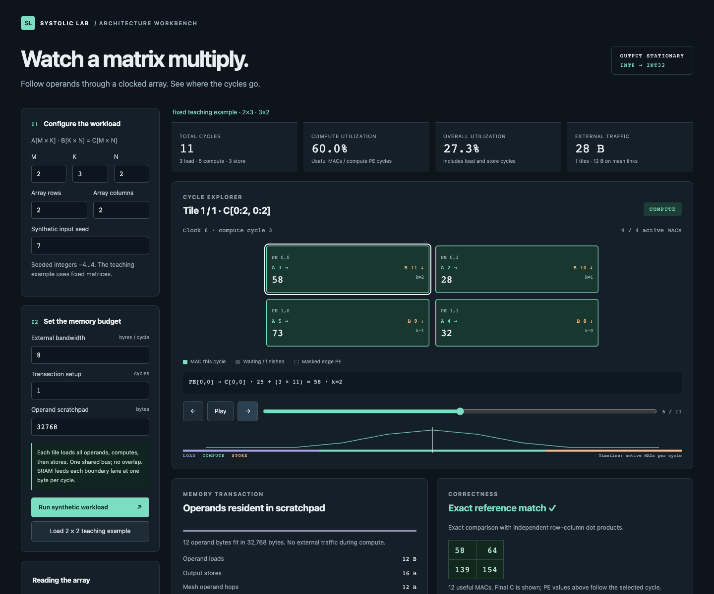
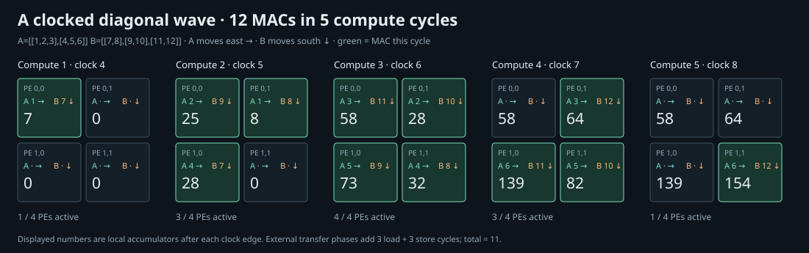
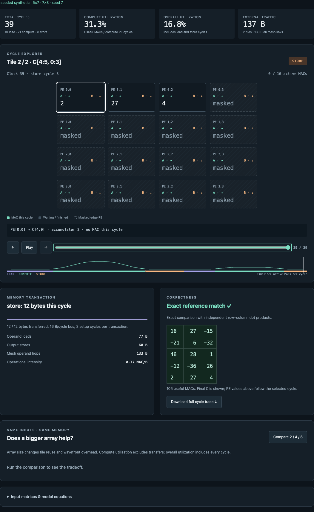

# Systolic Lab

A small, cycle-level simulator for learning tiled matrix multiplication on a
systolic array. It implements registered operand transport, local accumulation,
partial output tiles, explicit memory transfers, and exact verification against
an independent mathematical reference. A local browser interface exposes every
clock edge, PE accumulator, and memory transaction.



The local interface at clock 6: all four PEs perform a MAC while the final
matrix remains visible in the correctness panel. The PE values show this clock.



## Run

Requires Python **3.10 or newer** and a modern browser for the optional interface.
There are no third-party Python packages, JavaScript packages, build tools, or
network services. Run commands from this directory; no installation is needed.

```sh
python3 -m systolic_lab serve
# Open http://127.0.0.1:8000
```

The server binds to loopback. `--port 8001` selects another port. Stop it with
Ctrl+C. The interface opens with a fixed teaching example; step, play, scrub,
inspect a PE, change dimensions or memory settings, compare 2×2/4×4/8×8 arrays,
and download the trace. Form submission generates seeded synthetic matrices.

```sh
python3 -m systolic_lab simulate --input examples/tiny.json \
  --rows 2 --cols 2 --bandwidth 8 --latency 1 --trace \
  --output results/tiny-trace.json

python3 -m systolic_lab simulate --m 5 --k 7 --n 3 \
  --rows 4 --cols 4 --seed 7 --bandwidth 16 --latency 2
```

The fixed example returns `[[58, 64], [139, 154]]`: 12 useful MACs, 5 compute
cycles, 3 load cycles, 3 store cycles, and 28 external bytes. The ragged example
uses two output tiles and returns in 39 modeled cycles. JSON input must contain
`a` and `b` rectangular integer matrices; operands must fit signed int8.



The 5×7 · 7×3 workload at clock 39: the last tile has three valid outputs and
thirteen masked PEs. The final store transfers 12 bytes.

## Model

An R×S physical array holds one output tile. A flows east, B flows south, and
each PE keeps its accumulator for the entire reduction dimension K. Each link
has a one-cycle register; each PE performs at most one MAC per cycle. Operands
are skewed so corresponding reduction indices arrive together.

Each tile follows **load → compute → store**, without overlap. Input elements
cost one byte; outputs cost four bytes. One shared external bus supplies the
configured bytes per cycle, after a setup latency for each transaction. The
scratchpad must fit `K(h+w)` operand bytes for the active h×w tile. On-chip
boundary reads and result gathering are idealized; see the complete assumptions,
equations, metric definitions, and trace semantics in [docs/model.md](docs/model.md).

## Validate and reproduce

```sh
python3 -m unittest discover -s tests -v
python3 -m experiments.run
# Optional convenience targets: make test demo experiments serve
```

The tests check known products, cycle timing and operand forwarding, 240 seeded
random shapes and rectangular arrays, signed extremes, zero operands, ragged
tiles, bandwidth accounting, capacity limits, invalid inputs, trace/summary
agreement, and the live local HTTP API. [docs/validation.md](docs/validation.md)
records the executed checks and their environment.

[The CI workflow](.github/workflows/ci.yml) runs the same tests on Python 3.10,
3.13, and 3.14 on Ubuntu 24.04. It regenerates the teaching trace, both SVGs,
and the experiment JSON/CSV, then requires an empty diff against the committed
results. No project dependencies are installed. Per-commit results are available
in the repository's Actions tab.

Experiments write deterministic JSON, CSV, and a standalone SVG to `results/`.
All data is synthetic; seed and input SHA-256 accompany each case. The included
results are simulation counts, not software throughput or hardware measurements.

| Array | 32×32 by 32×32 cycles | Compute utilization | External bytes |
| --- | ---: | ---: | ---: |
| 2×2 | 12,032 | 94.12% | 36,864 |
| 4×4 | 3,968 | 84.21% | 20,480 |
| 8×8 | 1,568 | 69.57% | 12,288 |

Shared settings: 16 B/cycle, 2 setup cycles, 32 KiB operand scratchpad, seed 7.
Larger arrays reduce cycles and repeated operand loads here, while a greater
fraction of PE slots are empty during wavefront fill and drain.
[docs/experiments.md](docs/experiments.md) explains all 11 cases and the baseline.

## Layout and limits

`systolic_lab/simulator.py` contains the clocked model; `reference.py` contains
the independent oracle; `server.py` and `web/` provide the local interface.
`tests/`, `examples/`, `experiments/`, and `docs/` contain verification and
reproducible explanations.

CLI dimensions are 1…128 and arrays 1…16 per axis; the browser uses dimensions
1…32 and arrays 1…8. Traces are limited to 20,000 cycles and 500,000 PE states.
Summary mode avoids those trace limits. K is not tiled: an oversized operand
tile is rejected. No floating point, quantization, sparse skipping, cross-tile
reuse, bank conflicts, overlap, energy estimates, RTL, or synthesis is included.
This output-stationary model is inspired by systolic principles; it does not
reproduce the original TPU's preloaded-weight dataflow or instruction timing.

[docs/sources.md](docs/sources.md) cites the primary architecture sources and
records material provenance. No distribution license has been selected.
