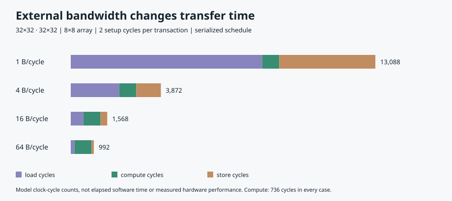

# Reproducible experiments

Run `python3 -m experiments.run` from the project root. Every case uses synthetic
integers uniformly drawn from −4…4 with `random.Random(7)`. A is generated before
B in row-major order. JSON and CSV include dimensions, all model settings, seed,
input SHA-256, counters, and exact-oracle verification status. The checksum is
over UTF-8 `json.dumps({"a": a, "b": b}, separators=(",", ":"))`. Output is
deterministic and contains no elapsed-time measurement.

## Array size

Fixed workload: M=K=N=32; β=16 B/cycle; L=2; Q=32,768 bytes.

| Array | Tiles | Load clocks | Compute clocks | Store clocks | Total clocks | Compute util. | Overall util. | External B |
| --- | ---: | ---: | ---: | ---: | ---: | ---: | ---: | ---: |
| 2×2 | 256 | 2,560 | 8,704 | 768 | 12,032 | 94.12% | 68.09% | 36,864 |
| 4×4 | 64 | 1,152 | 2,432 | 384 | 3,968 | 84.21% | 51.61% | 20,480 |
| 8×8 | 16 | 544 | 736 | 288 | 1,568 | 69.57% | 32.65% | 12,288 |

All cases perform 32,768 MACs and write 4,096 output bytes. A larger array
reduces repeated operand loads and transaction count. Its diagonal fill/drain
uses a larger fraction of the available compute slots, so utilization decreases
while total cycles improve. Utilization alone does not rank latency.

For a representative 8×8 tile: load = 2+ceil(512/16)=34 clocks; compute =
32+8+8−2=46; store = 2+ceil(256/16)=18; 16×(34+46+18)=1,568.
The no-reuse scalar traffic baseline is 69,632 B; the 8×8 schedule uses 12,288 B,
about 5.67 times less logical external traffic. This is not a software speedup.

## External bandwidth

Fixed workload: M=K=N=32; 8×8 array; L=2; Q=32,768 bytes.

| β B/cycle | Load clocks | Compute clocks | Store clocks | Total clocks | Overall utilization |
| --- | ---: | ---: | ---: | ---: | ---: |
| 1 | 8,224 | 736 | 4,128 | 13,088 | 3.91% |
| 4 | 2,080 | 736 | 1,056 | 3,872 | 13.22% |
| 16 | 544 | 736 | 288 | 1,568 | 32.65% |
| 64 | 160 | 736 | 96 | 992 | 51.61% |

External bytes remain 12,288, compute utilization remains 69.57%, and the exact
result remains identical. At 1 B/cycle, transfer phases occupy 12,352 of 13,088
cycles. At 64 B/cycle they occupy 256 of 992 cycles. The serial schedule's limit
as bandwidth grows is the compute time plus transaction setup and at least one
transfer edge per transaction; overlap could change that limit and is excluded.

## Partial tiles and skinny shapes

Fixed settings: 4×4 array; β=16 B/cycle; L=2; Q=32,768 bytes.

| M,K,N | Tiles | MACs | Total clocks | Compute utilization | Overall utilization | External B |
| --- | ---: | ---: | ---: | ---: | ---: | ---: |
| 8,16,8 | 4 | 1,024 | 152 | 72.73% | 42.11% | 768 |
| 9,16,9 | 9 | 1,296 | 291 | 45.00% | 27.84% | 1,188 |
| 5,7,3 | 2 | 105 | 39 | 31.25% | 16.83% | 137 |
| 1,32,16 | 4 | 512 | 200 | 22.86% | 16.00% | 704 |

The 9×9 output crosses a 4×4 tiling boundary in both axes, adding five tiles
relative to 8×8. These workloads differ in MAC count; their cycle ratio is not
an equal-work speedup. In the 5×3 output, the valid tiles are 4×3 and 1×3:
compute clocks = (7+4+3−2)+(7+1+3−2)=21, load bytes = 49+28=77, store bytes =
48+12=60. No padded operand traffic is charged, but masked PEs remain in the
utilization denominator. A one-row workload leaves three physical rows unused.

## Capacity and interpretation

For the teaching tile h=w=2,K=3, Q=12 succeeds; Q=11 is rejected. Capacity is
a feasibility condition, not a continuous latency parameter. An experiment
with a small Q may require a smaller array because K tiling is absent.

Every listed result passed exact comparison to the independent reference.
All cycle/byte figures are model outputs on the same serial memory schedule.
No power, area, frequency, software execution time, or accelerator hardware was
measured. Results cannot establish TPU, GPU, or CPU performance.
